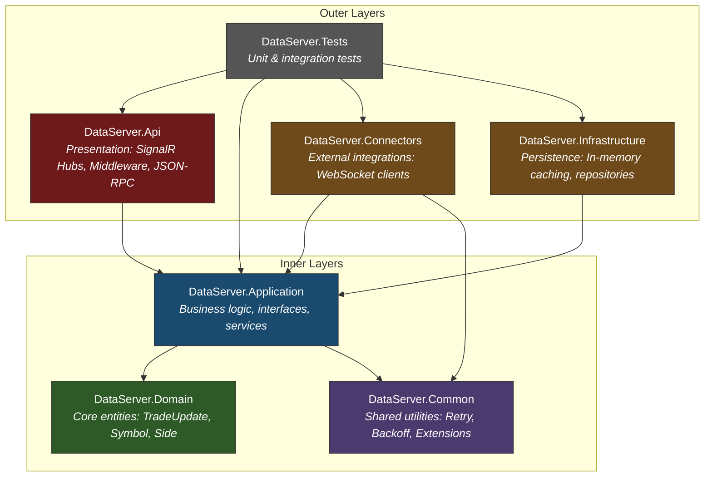
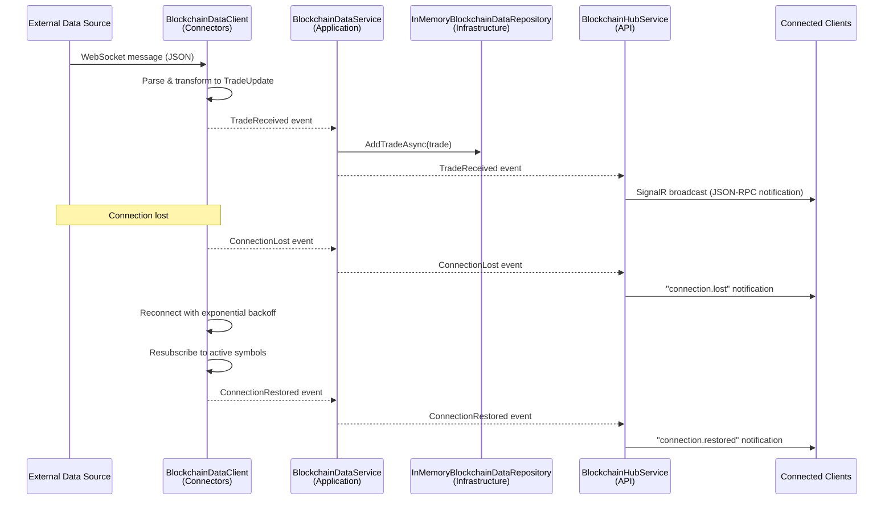

# DataServer - Modular Real-Time Data Aggregation Platform

> A pluggable, event-driven data aggregation and distribution platform built with Clean Architecture. Connect any data source through interface abstraction and stream updates to clients in real time. Blockchain trade data serves as the first implementation example.

## Overview

DataServer is a **modular real-time data aggregation platform** designed to collect, normalize, cache, and distribute live data from any external source. The architecture is built around **interface abstraction**: every data source interaction is defined by contracts in the Application layer, meaning **any data source can be integrated** without modifying business logic, infrastructure, or client-facing APIs.

The first concrete implementation connects to a blockchain WebSocket API and streams cryptocurrency trade updates (BTC-USD, ETH-USD) to Angular web clients and Python CLI clients via SignalR. However, blockchain is simply one connector; the same patterns support financial market feeds, IoT sensors, social media streams, or any other real-time data provider.

```
┌─────────────────────────────────────────────────────────┐
│                    External Data Sources                 │
│   (Blockchain API, Market Feeds, IoT, Custom APIs...)   │
└──────────────────────────┬──────────────────────────────┘
                           │ WebSocket / HTTP / gRPC
                ┌──────────▼──────────┐
                │     Connectors      │  ← Implement IBlockchainDataClient
                │  (Pluggable Layer)  │
                └──────────┬──────────┘
                           │ Domain Events
                ┌──────────▼──────────┐
                │  Application Logic  │  ← Orchestration, Subscriptions
                └──────────┬──────────┘
                           │
                ┌──────────▼──────────┐
                │   Infrastructure    │  ← Caching, Storage
                └──────────┬──────────┘
                           │
                ┌──────────▼──────────┐
                │     API Layer       │  ← SignalR Hub, JSON-RPC
                └──────────┬──────────┘
                           │
              ┌────────────▼────────────┐
              │        Clients          │
              │  (Web, CLI, Mobile...)  │
              └─────────────────────────┘
```

## Key Features

- **Real-time distribution** - Push-based streaming via SignalR with JSON-RPC 2.0 protocol, group-based broadcasting, and automatic client notification of connection state changes
- **Resilience** - Automatic reconnection with configurable exponential backoff (1s to 30s), active subscription tracking with automatic resubscription after recovery, and connection loss/restore event propagation
- **Testability** - Interface-driven design enables complete mocking at every boundary; includes stub clients, test factories, and Python-based simulators for full offline development
- **Configuration-driven** - Switch between real APIs and local simulators by changing a single URL in `appsettings.json`; all retry behavior, delays, and connection parameters are externally configurable
- **Pluggable data sources** - Add new connectors by implementing a single interface; no changes required to business logic, infrastructure, or API layers

## Architecture

### Clean Architecture Layers

The server follows a strict Clean Architecture with dependencies flowing inward. No inner layer references an outer layer directly.



| Layer | Project | Responsibility |
|-------|---------|---------------|
| **Domain** | `DataServer.Domain` | Core entities (`TradeUpdate`, `Symbol`, `Side`) with zero dependencies |
| **Application** | `DataServer.Application` | Business logic, service interfaces (`IBlockchainDataClient`, `IBlockchainDataRepository`), orchestration |
| **Connectors** | `DataServer.Connectors` | External data source implementations (WebSocket clients, message parsing) |
| **Infrastructure** | `DataServer.Infrastructure` | Data persistence (in-memory caching with deduplication) |
| **API** | `DataServer.Api` | Presentation layer (SignalR hubs, JSON-RPC handling, middleware, DI configuration) |
| **Common** | `DataServer.Common` | Cross-cutting utilities (retry logic, backoff strategies, enum extensions) |
| **Tests** | `DataServer.Tests` | Comprehensive test suite (unit, integration, stubs, test factories) |

### Connector Pattern - The Abstraction Point

The key to extensibility is `IBlockchainDataClient`, defined in the **Application** layer. Any data source connector implements this interface, and the rest of the system remains unchanged:

```csharp
public interface IBlockchainDataClient
{
    Task ConnectAsync(CancellationToken cancellationToken = default);
    Task DisconnectAsync(CancellationToken cancellationToken = default);
    bool IsConnected { get; }

    Task SubscribeToTradesAsync(Symbol symbol, CancellationToken cancellationToken = default);
    Task UnsubscribeFromTradesAsync(Symbol symbol, CancellationToken cancellationToken = default);

    event EventHandler<TradeUpdate>? TradeReceived;
    event EventHandler<TradeResponse>? SubscriptionConfirmed;
    event EventHandler? ConnectionLost;
    event EventHandler? ConnectionRestored;
}
```

Supporting interfaces complete the abstraction:

```csharp
public interface IBlockchainDataRepository
{
    Task AddTradeAsync(TradeUpdate trade, CancellationToken cancellationToken = default);
    Task<IReadOnlyList<TradeUpdate>> GetRecentTradesAsync(
        Symbol symbol, int count = 100, CancellationToken cancellationToken = default);
    Task ClearTradesAsync(Symbol symbol, CancellationToken cancellationToken = default);
}

public interface IBackoffStrategy
{
    TimeSpan GetDelay(int attemptNumber);
}
```

To add a new data source, implement `IBlockchainDataClient` and register it in DI - no other code changes required.

### Event-Driven Data Flow

Data flows through the system via events, maintaining loose coupling between layers:



### Dependency Injection Configuration

All services are registered as singletons in `Program.cs`, enabling a single shared data pipeline:

```csharp
// Resilience infrastructure
builder.Services.AddSingleton<IBackoffStrategy, ExponentialBackoffStrategy>();
builder.Services.AddSingleton<RetryConnector>();

// Data pipeline (swap implementations here to change data sources)
builder.Services.AddSingleton<IWebSocketClient, ResilientWebSocketClient>();
builder.Services.AddSingleton<IBlockchainDataClient, BlockchainDataClient>();
builder.Services.AddSingleton<IBlockchainDataRepository, InMemoryBlockchainDataRepository>();
builder.Services.AddSingleton<ISubscriptionManager, SubscriptionManager>();
builder.Services.AddSingleton<IBlockchainDataService, BlockchainDataService>();

// Background worker for broadcasting
builder.Services.AddHostedService<BlockchainHubService>();
```

To swap in a different data source, change the `IBlockchainDataClient` registration:

```csharp
// Instead of blockchain:
builder.Services.AddSingleton<IBlockchainDataClient, MyCustomDataClient>();
```

### Resilience Patterns

The platform implements layered resilience with configurable behavior:

**Retry with Exponential Backoff**

```csharp
public class RetryConnector(IBackoffStrategy backoffStrategy, ILogger logger)
{
    public async Task ExecuteWithRetryAsync(Func<Task> action, CancellationToken token)
    {
        var attemptNumber = 0;
        while (!token.IsCancellationRequested)
        {
            try
            {
                await action();
                return;
            }
            catch (Exception ex)
            {
                attemptNumber++;
                var delay = backoffStrategy.GetDelay(attemptNumber);
                logger.Information(
                    "Attempt {attempt} failed with {error}. Retrying after {delay}...",
                    attemptNumber, ex.Message, delay);
                await Task.Delay(delay, token);
            }
        }
    }
}
```

**Configurable Backoff** (`appsettings.json`):

```json
{
  "Backoff": {
    "InitialDelay": "00:00:01",
    "MaxDelay": "00:00:30",
    "Multiplier": 2.0,
    "Increment": "00:00:01"
  }
}
```

| Attempt | Delay |
|---------|-------|
| 1 | 2s |
| 2 | 4s |
| 3 | 8s |
| 4 | 16s |
| 5+ | 30s (capped) |

**Automatic Reconnection & Resubscription** - When a connection drops, the `BlockchainDataClient` automatically reconnects using `ResilientWebSocketClient` (which wraps retry logic), then resubscribes to all previously active symbols. Connection state changes propagate through every layer to notify connected clients.

## Blockchain Implementation (Example Connector)

The blockchain connector demonstrates the full pattern with a real-world WebSocket data source.

### WebSocket Connection Management

`BlockchainDataClient` establishes a persistent WebSocket connection and runs a background receive loop:

- Connects via `ResilientWebSocketClient` (automatic retry on failure)
- Spawns a background task for continuous message reception
- Supports graceful disconnect with cancellation token propagation

### JSON Message Parsing & Transformation

Incoming WebSocket messages are parsed from raw JSON into domain `TradeUpdate` records:

```csharp
public record TradeUpdate(
    int Seqnum,
    Event Event,
    Channel Channel,
    Symbol Symbol,
    DateTimeOffset Timestamp,
    Side Side,
    decimal Qty,
    decimal Price,
    string TradeId
);
```

The client handles three message types:
- **`subscribed`/`unsubscribed`** - Subscription confirmations, emitted via `SubscriptionConfirmed` event
- **`updated`** - Trade data, transformed into `TradeUpdate` and emitted via `TradeReceived` event

### Subscription Management

Subscriptions are reference-counted via `SubscriptionManager` to prevent duplicate downstream subscriptions when multiple clients subscribe to the same symbol:

```csharp
public interface ISubscriptionManager
{
    bool ShouldSubscribeDownstream(Symbol symbol);
    bool ShouldUnsubscribeDownstream(Symbol symbol);
}
```

- First client subscribing to BTC-USD triggers an actual WebSocket subscription
- Subsequent clients increment the reference count without additional WebSocket messages
- Only when the last client unsubscribes does the downstream unsubscribe fire

### Automatic Reconnection & Resubscription

When the WebSocket connection is lost (server close or network error):

1. `ConnectionLost` event fires, notifying all layers up to connected clients
2. `ResilientWebSocketClient` reconnects with exponential backoff
3. All previously active subscriptions are automatically resubscribed
4. `ConnectionRestored` event fires, prompting clients to resubscribe

### In-Memory Caching with Deduplication

`InMemoryBlockchainDataRepository` stores recent trades per symbol using `IMemoryCache`:

- **Deduplication** via `HashSet<string>` tracking `TradeId` values - duplicate trades are silently discarded
- **Thread-safe** access with explicit locking
- **Queryable** by symbol with configurable result count (default: 100 most recent)

## Project Structure

```
epace-sandbox/
├── server/                            # .NET backend (Clean Architecture)
│   ├── DataServer.Api/                # SignalR hubs, middleware, JSON-RPC, DI setup
│   ├── DataServer.Application/        # Business logic, interfaces, service contracts
│   ├── DataServer.Connectors/         # WebSocket client, resilient wrapper
│   ├── DataServer.Domain/             # Core entities (TradeUpdate, Symbol, Side)
│   ├── DataServer.Infrastructure/     # In-memory caching, repository implementation
│   ├── DataServer.Common/             # Retry logic, backoff strategies, extensions
│   └── DataServer.Tests/              # xUnit tests with Moq
├── client/                            # Angular web application
│   └── src/
│       ├── app/                       # Root components, routing, navbar
│       ├── blockchain/                # Trade display components
│       └── rpc/                       # Generic RPC client, SignalR transport
├── simulators/                        # Python mock servers & test clients
│   ├── blockchain_api/                # Mock WebSocket server
│   ├── blockchain_client/             # CLI test client with disconnect controls
│   └── disconnect_controls/           # Connection testing framework
└── README.md
```

## Benefits

### Extensibility

Adding a new data source requires implementing a single interface. The connector pattern means new integrations don't touch business logic, caching, API, or client code. DI registration is the only wiring needed.

### Testability

- Every layer boundary is defined by an interface, enabling isolated unit testing with mocks
- `StubBlockchainDataClient` provides a test double that logs actions and raises events without network access
- `TestTradeFactory` generates consistent test data across the test suite
- Python simulators enable full end-to-end testing without external API dependencies
- Disconnect controllers allow systematic testing of failure and recovery scenarios

### Maintainability

- Clean Architecture enforces dependency direction, preventing circular references
- Domain entities have zero external dependencies
- Configuration is externalized in `appsettings.json` with environment-specific overrides
- Structured logging via Serilog provides operational visibility at every layer

## Getting Started

### Prerequisites

- [.NET 9 SDK](https://dotnet.microsoft.com/download)
- [Node.js 20+](https://nodejs.org/) (for the Angular client)
- [Python 3.10+](https://www.python.org/) (for simulators)

### 1. Start the Simulator (Mock Data Source)

```bash
cd simulators/blockchain_api
pip install -r requirements.txt
python cli-client-server.py
```

This starts a mock WebSocket server on `ws://localhost:5000/ws` that generates synthetic trade data.

### 2. Start the Server

```bash
cd server
dotnet run --project DataServer.Api
```

The server starts on `https://localhost:5001` with the SignalR hub available at `/blockchain`. In development mode, it connects to the local simulator automatically.

### 3. Start the Client

```bash
cd client
npm install
npm start
```

The Angular dev server starts on `http://localhost:4200` and connects to the backend SignalR hub.

### 4. (Optional) Python CLI Client

```bash
cd simulators/blockchain_client
pip install -r requirements.txt
python cli-client.py
```

The CLI client provides interactive disconnect testing with modes: graceful, abrupt, temporary drop, and quit.

### Running Tests

```bash
# Backend tests (xUnit + Moq)
cd server && dotnet test

# Frontend tests (Vitest)
cd client && npm test
```

### Configuration

Switch between data sources by editing `appsettings.Development.json`:

```json
{
  "Blockchain": {
    "ApiUrl": "ws://localhost:5000/ws",
    "ApiToken": ""
  }
}
```

| Setting | Description | Default |
|---------|-------------|---------|
| `Blockchain:ApiUrl` | WebSocket endpoint for the data source | `ws://localhost:5000/ws` (dev) |
| `Blockchain:ApiToken` | Optional authentication token | `""` |
| `Backoff:InitialDelay` | First retry delay | `00:00:01` |
| `Backoff:MaxDelay` | Maximum retry delay cap | `00:00:30` |
| `Backoff:Multiplier` | Exponential backoff multiplier | `2.0` |

## Future Enhancements

### Data Source Capabilities

- **Multiple simultaneous data sources** - Connect to several providers in parallel, aggregating data from multiple streams into a unified output
- **New connector types** - REST polling connectors, gRPC stream connectors, message queue consumers (Kafka, RabbitMQ)
- **Data source health scoring** - Rank and prioritize data sources based on latency, reliability, and data quality
- **Source failover** - Automatic switching to backup data sources when the primary becomes unavailable

### Resilience

- **Circuit breaker pattern** - Prevent cascade failures by halting requests to consistently failing sources after a threshold
- **Health check endpoints** - Expose `/health` and `/ready` endpoints for orchestrator integration (Kubernetes, Docker Compose)
- **Rate limiting** - Protect downstream clients and upstream sources from excessive request volume
- **Graceful degradation** - Serve cached data when live sources are unavailable, with staleness indicators

### Storage

- **Distributed caching** - Replace in-memory cache with Redis or similar for horizontal scaling across multiple server instances
- **Retention policies** - Configurable time-based and count-based eviction (e.g., keep last 24 hours or last 10,000 trades per symbol)
- **Persistent storage** - Optional write-through to a database (PostgreSQL, TimescaleDB) for historical queries
- **Cache warming** - Pre-populate caches on startup from persistent storage to avoid cold-start latency

### Observability

- **Distributed tracing** - OpenTelemetry integration for end-to-end request tracing across services
- **Metrics collection** - Prometheus-compatible metrics: trades/second, connection uptime, cache hit rates, retry counts
- **Monitoring dashboards** - Grafana dashboards for real-time operational visibility
- **Alerting** - Configurable alerts on connection failures, data staleness, or throughput anomalies

### API Features

- **REST API** - HTTP endpoints for historical trade queries, subscription management, and system status
- **GraphQL** - Flexible query interface with subscription support for clients needing custom data shapes
- **Authentication & authorization** - JWT-based auth with role-based access control for subscription tiers
- **API versioning** - Versioned endpoints to support backward compatibility as the API evolves

### Testing

- **Integration test suite** - Automated tests exercising the full pipeline from WebSocket source through to SignalR client
- **Chaos engineering** - Automated failure injection (network partitions, latency spikes, message corruption) to validate resilience
- **Performance testing** - Load tests measuring throughput and latency under high-volume data ingestion with many concurrent clients
- **Contract testing** - Verify connector implementations conform to interface contracts with automated compliance checks 
